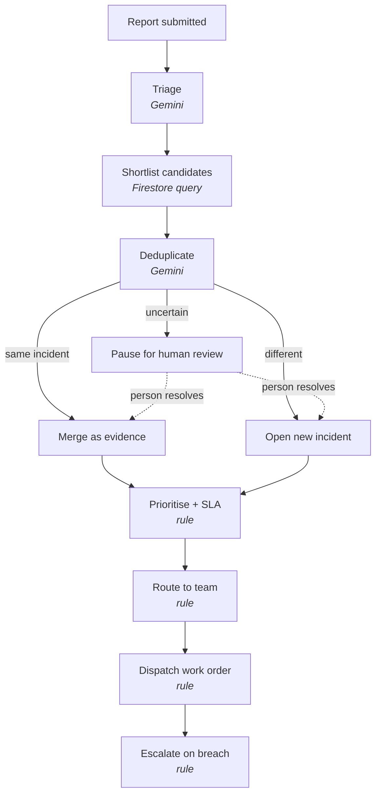

# Relay
 
Relay is an AI facilities coordination agent for university campuses. It reads
maintenance reports written in plain language, recognises when several reports
describe the same underlying fault, and carries each incident through
prioritisation, routing, and dispatch while recording the reasoning behind
every decision.

## The Problem 

Campus facilities portals collect reports through a flat category dropdown with
no intelligence behind it, leaving a coordinator to read, classify, and route
each one by hand. Because reporters describe the same fault differently — a
leak in a third-floor restroom, water on a bathroom floor upstairs, a wet
corridor near the elevator — one physical problem routinely becomes several
tickets, and crews are dispatched more than once for the same job. The reverse
failure is worse: reports that arrive hours or days apart are never connected,
so a worsening fault reads as a series of unrelated minor complaints. Facilities
teams lose most of their time to this handoff gap rather than to the repairs
themselves.

## What Relay Does

A submitted report passes through six stages.

1. **Triage.** A language model reads the report and returns its issue
   category, any phrases indicating urgency, whether it describes danger, and
   which location details the reporter left out.
2. **Shortlist.** A database query narrows the comparison to open incidents in
   the same building, ranked by how plausibly they are the same fault.
3. **Deduplicate.** A language model decides whether the report describes an
   incident already being tracked, a separate problem, or something too
   ambiguous to call. Ambiguous reports are paused for a person rather than
   guessed at.
4. **Prioritise.** A rule sets priority and an SLA deadline from how many
   people reported the problem and how many described danger.
5. **Route.** A rule assigns the maintenance team that owns the issue category
   on this campus.
6. **Dispatch.** A work order is raised with field instructions built from what
   each reporter actually said.

Once those stages finish, the Incident Coordinator reads the resulting state
and decides what follow-up it warrants: telling the assigned team about a
priority change, running an escalation check, asking a reporter for a detail
that would place an unplaceable report, or judging that nothing is needed. It
cannot revisit any of the decisions above.

A separate sweep escalates any incident that passes its deadline, raising it
through the campus escalation policy until it is resolved or reaches the
configured maximum level.

Every decision is recorded with its reasoning, what executed it, and the model
behind it where there was one. Triage's classification is stored on the report
itself. Together these are what an operator reads when asking why an incident
was handled as it was.

## Architecture



Gemini is used for three things, each a judgement no rule can make: what a
report is about, whether two reports describe one fault, and what follow-up an
incident's new state warrants. Everything between them — priority, routing,
dispatch, escalation — is deterministic rule application over campus
configuration, so the same evidence always produces the same priority, the same
team, and the same escalation. That is what makes an escalation defensible when
someone asks why a work order jumped the queue.

### Execution types

Every decision Relay records names what executed it, because three different
kinds of act would otherwise be indistinguishable in the audit trail.

| Executor | Role | Used by |
| --- | --- | --- |
| `model` | Probabilistic interpretation | Deduplication |
| `rule` | Deterministic policy | Priority, routing, escalation, status transitions |
| `agent` | State-aware coordination | The Incident Coordinator |
| `human` | Explicit human judgement | Resolving a paused report |

A single report produces all three automated kinds in sequence: a model judges
whether it duplicates an open incident, rules apply campus policy to set
priority and choose a team, and the coordinator decides what follow-up the
resulting state warrants. Triage is a model judgement too, but its output is
stored on the report rather than as a separate decision record.

**Why each piece.** Gemini handles the natural-language judgements the rest of
the system deliberately avoids. Firestore holds reports, incidents, work
orders, and the decision log, and its document model fits records that
accumulate evidence over time. Cloud Storage is provisioned for report photos.
The backend is FastAPI because the pipeline is typed request-response work,
and Pydantic validation at the boundary means a malformed model response fails
loudly rather than reaching the database. The frontend is a small React
application because the operations view is read-heavy and needs live SLA
counters.

## Tech Stack

- **Gemini 3.5 Flash** (via Vertex AI) — report classification, duplicate
  detection, and the coordinator's reasoning
- **Google ADK**: Powers Relay's Incident Coordinator, which observes evolving
  incident state and selects constrained follow-up actions such as retrieving
  incident context, requesting missing information, notifying teams of priority
  changes, running escalation checks, or deliberately taking no action when the
  current state does not require intervention.

  Relay intentionally separates model judgment, deterministic operational
  policy, and agent coordination. Gemini handles ambiguous interpretation and
  deduplication, rule-based services enforce reproducible priority and routing
  policies, and the ADK coordinator decides what follow-up action is
  appropriate after the incident state changes.
- **Firestore** — reports, incidents, work orders, decision log
- **Cloud Storage** — report photos; *bucket provisioned, upload not yet built*
- **Cloud Run** — *target deployment; not yet deployed*
- **FastAPI / Python 3.12+** — backend
- **React / TypeScript / Vite** — operations dashboard

## Setup

### Prerequisites

- Python 3.12 or later, Node.js 20 or later
- A Google Cloud project with Firestore in Native mode, a Cloud Storage bucket,
  and the Vertex AI API enabled
- The `gcloud` CLI, authenticated

### Environment

Copy `backend/.env.example` to `backend/.env` and set:

| Variable | Purpose |
| --- | --- |
| `GOOGLE_CLOUD_PROJECT` | Project owning Firestore, Storage, and Vertex AI |
| `RELAY_STORAGE_BUCKET` | Bucket for report photos |
| `RELAY_GEMINI_MODEL` | Model id; defaults to `gemini-3.5-flash` |
| `RELAY_GEMINI_LOCATION` | Vertex AI location; must be `global` for Gemini 3.x |
| `RELAY_CAMPUS_ID` | Campus configuration document to load |
| `RELAY_ALLOWED_ORIGINS` | Browser origins permitted by CORS |

Relay authenticates through Application Default Credentials, so no API key is
required. The credentials need the Vertex AI User, Datastore User, and Storage
Object Admin roles.

Gemini 3.x models are served only from the Vertex AI `global` endpoint.
Requesting one from a single region returns HTTP 404, which resembles an access
error but is a region availability issue.

### Run locally

```bash
# Backend
cd backend
python -m venv .venv
.venv/bin/pip install -r requirements.txt
gcloud auth application-default login
.venv/bin/python -m scripts.seed_campus_config     # one-time campus setup
.venv/bin/uvicorn main:app --reload --port 8080
```

```bash
# Frontend
cd frontend
npm install
cp .env.example .env.local                          # defaults to :8080
npm run dev
```

To confirm all three cloud dependencies are reachable before starting:

```bash
cd backend && .venv/bin/python -m scripts.dev.verify_setup
```

## API

| Method | Path | Purpose |
| --- | --- | --- |
| `POST` | `/reports` | Submit a report and run it through the pipeline |
| `GET` | `/incidents` | List incidents that are still live work |
| `GET` | `/incidents/{id}` | One incident with its reports and decision trail |
| `POST` | `/reports/{id}/resolve` | Resolve a report awaiting human review |
| `GET` | `/campus` | Buildings, floors, rooms, and maintenance teams |
| `GET` | `/reviews` | Reports paused for human review |
| `POST` | `/admin/check-overdue` | Run one pass of the escalation sweep |
| `GET` | `/healthz` | Liveness probe |

Interactive documentation is served at `/docs` while the backend is running.

## Team

Dedeepya Guntaka

Swetha Jalluri

Likhitha Guntaka

## Built For

All Things Agentic Hackathon — Taskmaster track
