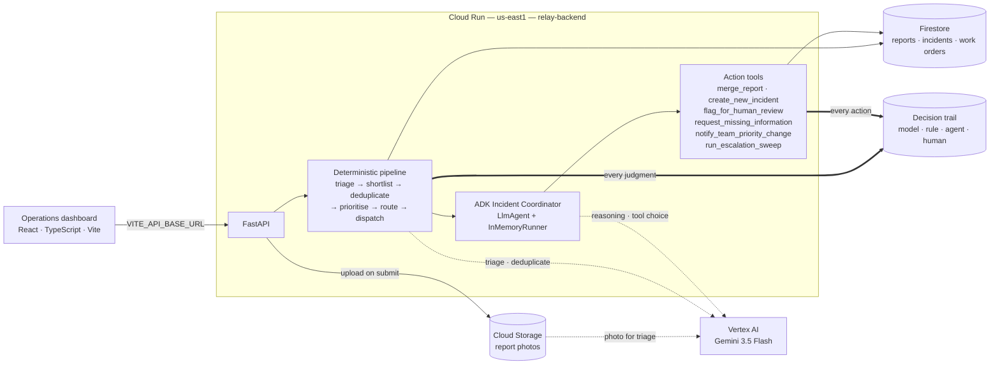

# Relay

Relay is an AI facilities coordination agent for university campuses. Someone
reports a problem in their own words — a leaking ceiling, a door that will not
latch, a light that keeps flickering — and Relay works out what the report is
about, whether it is a new problem or another account of one already being
worked on, how urgent it is, and which team owns it. It raises the work order,
watches the deadline, and escalates if the deadline passes. When it genuinely
cannot tell where a report belongs, it says so and asks a person, rather than
guessing. Every decision it makes is written down with the reasoning behind it,
so a coordinator can always answer why an incident was handled the way it was.

## The problem

Campus facilities portals collect reports through a flat category dropdown with
no intelligence behind it, leaving a coordinator to read, classify, and route
each one by hand. Because reporters describe the same fault differently — a
leak in a third-floor restroom, water on a bathroom floor upstairs, a wet
corridor near the elevator — one physical problem routinely becomes several
tickets, and crews are dispatched more than once for the same job. The reverse
failure is worse: reports that arrive hours or days apart are never connected,
so a worsening fault reads as a series of unrelated minor complaints. Facilities
teams lose most of their time to this handoff gap rather than to the repairs
themselves.

## What Relay does

A submitted report passes through six stages.

1. **Triage.** A language model reads the report and returns its issue
   category, any phrases indicating urgency, whether it describes danger, and
   which location details the reporter left out.
2. **Shortlist.** A database query narrows the comparison to open incidents in
   the same building, ranked by how plausibly they are the same fault.
3. **Deduplicate.** A language model decides whether the report describes an
   incident already being tracked, a separate problem, or something too
   ambiguous to call. Ambiguous reports are paused for a person rather than
   guessed at.
4. **Prioritise.** A rule sets priority and an SLA deadline from how many
   people reported the problem and how many described danger.
5. **Route.** A rule assigns the maintenance team that owns the issue category
   on this campus.
6. **Dispatch.** A work order is raised with field instructions built from what
   each reporter actually said.

Once those stages finish, the **Incident Coordinator** — a Google ADK agent —
reads the resulting state and decides what should happen next, which the
pipeline has no rule for. It can tell the assigned team that a priority moved,
run an escalation sweep, ask a reporter for the one detail that would place an
unplaceable report, place the report itself, or leave it for a person and say
what they need to settle. These are real actions, not suggestions: each one
writes to Firestore and records its own decision. It cannot revisit triage,
deduplication, priority, or routing, and has no tools to do so.

A separate sweep escalates any incident that passes its deadline, raising it
through the campus escalation policy until it is resolved or reaches the
configured maximum level.

## How Relay decides

Relay mixes three kinds of execution on purpose, and every decision it records
names which one produced it. Collapsing them would hide the architecture rather
than describe it: a category judgement and a team lookup are not the same kind
of act, and an auditor asking why a work order was routed somewhere deserves to
see which one answered.

| Executor | Role | Used by |
| --- | --- | --- |
| `model` | Probabilistic interpretation | Triage, deduplication |
| `rule` | Deterministic policy | Priority, routing, escalation, status transitions |
| `agent` | State-aware coordination | The Incident Coordinator |
| `human` | Explicit human judgement | Resolving a paused report |

**Gemini handles only what no rule can settle**: what a report is about, and
whether two reports describe one physical fault. Everything between — priority,
routing, dispatch, escalation — is deterministic policy applied to recorded
evidence.

That split is a deliberate auditability choice, not a shortcut taken to avoid
model calls. Priority and escalation are the claims a facilities manager is most
likely to be challenged on, and a rule means the same evidence always produces
the same answer: reproducible from the incident and the campus configuration
alone, months later, without re-running anything. Asking a model to weigh
urgency would make the most contested decision in the system the least
explainable one.

**The agent occupies the gap the other two leave.** A rule cannot decide what to
do about a report deduplication declined to place, because the whole point is
that no rule fit. Left alone, such a report simply waits. The coordinator looks
at the same evidence and often finds a better answer — ask the reporter one
specific question, place the report itself, or agree that a human is genuinely
needed and say what they must decide.

## A worked example: the report Relay refused to guess at

This is live in the deployed system right now, and it is the clearest evidence
of judgement in the project.

Two card readers at Ridgeway Library and Commons were reported broken, at
different entrances, and were correctly opened as two separate incidents:

- `inc_63dd6783f2a3` — north entrance, `access`, `low`, 1 report
- `inc_e9e259a2c470` — south entrance, `access`, `low`, 1 report

A third report then arrived, `rpt_6e3670b66382`:

> A card reader at one of the Ridgeway Library entrances rejected my badge three
> times this morning. I usually come in through a side door and I genuinely
> could not tell you whether it was the north or the south entrance.

Deduplication declined to place it, and said why:

> The reporter is unsure whether the malfunctioning card reader was at the north
> or south entrance of the Ridgeway Library. Because there are two separate
> active incidents for these locations — one for the south entrance card reader
> (`inc_e9e259a2c470`) and one for the north entrance card reader
> (`inc_63dd6783f2a3`) — we cannot assign this report to either without risking
> a false match.

This is the failure the verdict exists to prevent. Merging into the wrong one of
two open incidents hides a live fault behind a ticket raised for a different
one, and unlike splitting one problem into two tickets it does not correct
itself: the second broken reader simply stops being visible to anyone.

The coordinator then picked the report up, read **both** candidate incidents
before deciding, and deliberately escalated to a person:

> The reporter is unable to specify the entrance, so a human reviewer should
> look up the user's badge attempt logs or coordinate with the technician
> inspecting both library card readers.

The report sits in `pending_review`, linked to no incident, and appears on
`GET /reviews`. Its trail reads:

| Decision | Executor | Outcome |
| --- | --- | --- |
| `triage` | `model` | classified as access, no urgency signals |
| `deduplication` | `model` | paused for human review |
| `flag_for_human_review` | `agent` | left for human review |
| `incident_coordinator` | `agent` | `get_incident_state`, `get_incident_state`, `flag_for_human_review` |

The last two rows are the point. The agent inspected both competing incidents,
concluded that neither could be chosen on the evidence available, took a real
action to park the report, and recorded both the action and its reasoning. That
is a decision not to act autonomously — which is itself an autonomous decision,
and the one most likely to be right here.

## Architecture



The decision trail is cross-cutting: every stage of the pipeline and every
action the agent takes writes to it, which is what makes an incident's history
readable end to end rather than reconstructed from logs.

## What the decision log currently holds

Live figures from Firestore, not targets. Over 270 decisions recorded, across
seven types — triage, deduplication, prioritization, routing, escalation,
resolution, and coordination — and the shape of them is the point:

| Executor | Share | What it decided |
| --- | --- | --- |
| `rule` | roughly half | Priority, routing, escalation, status transitions |
| `model` | roughly a third | Triage and deduplication |
| `agent` | most of the rest | The coordinator's follow-up calls and actions |
| `human` | one | A reviewer settling a report Relay declined to place |

The exact totals climb every time a report is submitted, so they are deliberately
not pinned here. Read the current ones straight from the source:
`GET /incidents/{id}` returns the full decision trail for any incident, each
entry naming what decided it.

**On the human count.** The review loop closes end to end, demonstrated once: a
reviewer answered a question the agent had asked and placed the report, and the
resolution was recorded as a human judgement alongside the agent's original
decision to ask. One instance is enough to show the path works, and not enough
to call it exercised.

**Every pipeline run since the coordinator was repaired has produced a
coordination record** — complete coverage, no run unaccounted for — including one
deliberately recorded with `outcome=error`. That entry exists because a failing
coordinator and a coordinator that was never invoked used to look identical in
the trail — the failure path returned before writing anything. It now records
the exception and its traceback like any other outcome, so silence means the
agent did not run, rather than that it broke quietly.

Six of the coordinator's seven tools have fired against live data:
`get_incident_state`, `merge_report`, `flag_for_human_review`,
`request_missing_information`, `notify_team_priority_change`, and
`run_escalation_sweep`. See [Known limitations](#known-limitations) for the
seventh.

## Tech stack

- **Gemini 3.5 Flash**, via Vertex AI — two structured calls per report, one for
  triage and one for deduplication, plus the coordinator's own reasoning.
  Responses are parsed into Pydantic models, so a malformed answer fails at the
  boundary instead of reaching the database.
- **Google ADK** — the Incident Coordinator is an `LlmAgent` driven by an
  `InMemoryRunner`, given seven tools and the freedom to use none of them.
  Its tools wrap the pipeline's own tools rather than reimplementing them, so an
  action the agent takes is the same action the pipeline would have taken, with
  the same validation behind it.
- **Firestore** (Native mode) — reports, incidents, work orders, campus
  configuration, and the decision log. The document model suits records that
  accumulate evidence over time.
- **Cloud Run** — hosts the backend; see [Deployment](#deployment).
- **Cloud Storage** — report photos, uploaded on submit and read back through
  short-lived signed URLs. A stored photo is passed to Gemini alongside the
  report text, so triage classifies from the picture as well as the words.
- **FastAPI / Python 3.12+** — the pipeline is typed request-response work.
- **React / TypeScript / Vite** — the operations dashboard, which is read-heavy
  and needs live SLA counters.

## Setup

### Prerequisites

- Python 3.12 or later, Node.js 20 or later
- A Google Cloud project with Firestore in Native mode, a Cloud Storage bucket,
  and the Vertex AI API enabled
- The `gcloud` CLI, authenticated

### Environment

Copy `backend/.env.example` to `backend/.env` and set:

| Variable | Purpose |
| --- | --- |
| `GOOGLE_CLOUD_PROJECT` | Project owning Firestore, Storage, and Vertex AI |
| `RELAY_STORAGE_BUCKET` | Bucket for report photos |
| `RELAY_GEMINI_MODEL` | Model id; defaults to `gemini-3.5-flash` |
| `RELAY_GEMINI_LOCATION` | Vertex AI location; must be `global` for Gemini 3.x |
| `RELAY_CAMPUS_ID` | Campus configuration document to load |
| `RELAY_ALLOWED_ORIGINS` | Browser origins permitted by CORS |

Relay authenticates through Application Default Credentials, so no API key is
required. The credentials need the Vertex AI User, Datastore User, and Storage
Object Admin roles.

Gemini 3.x models are served only from the Vertex AI `global` endpoint.
Requesting one from a single region returns HTTP 404, which resembles an access
error but is a region availability issue.

### Run locally

```bash
# Backend
cd backend
python -m venv .venv
.venv/bin/pip install -r requirements.txt
gcloud auth application-default login
.venv/bin/python -m scripts.seed_campus_config     # one-time campus setup
.venv/bin/uvicorn main:app --reload --port 8080
```

```bash
# Frontend
cd frontend
npm install
cp .env.example .env.local     # defaults to the deployed backend
npm run dev
```

The frontend points at the deployed Cloud Run service by default, so a fresh
clone runs against a live API with no backend setup at all. Change
`VITE_API_BASE_URL` to `http://localhost:8080` to develop against a local
backend instead.

To confirm all three cloud dependencies are reachable before starting:

```bash
cd backend && .venv/bin/python -m scripts.dev.verify_setup
```

## Deployment

The backend runs on Cloud Run:

| | |
| --- | --- |
| URL | `https://relay-backend-256118957814.us-east1.run.app` |
| Region | `us-east1` |
| Revision | `relay-backend-00008-77b` |
| Runtime service account | Vertex AI User, Datastore User, Storage Object Admin |

Deploy from `backend/`:

```bash
gcloud run deploy relay-backend --source . --region us-east1
```

`.gcloudignore` keeps the local virtualenv, bytecode, and `.env` out of the
build context — the image installs its own dependencies from
`requirements.txt`, and a shipped `.env` could silently override the environment
variables set on the service.

### Liveness: use `/health`, not `/healthz`

```
$ curl https://relay-backend-256118957814.us-east1.run.app/health
{"status":"ok","service":"relay-api"}
```

**Known platform quirk, not a bug in Relay.** On a `*.run.app` domain, Google's
frontend answers `GET /healthz` itself. The request returns a Google 404 and
never reaches the container: the response carries no `x-cloud-trace-context`
header, while every other path on the same service does. It is the exact string
that is claimed — `/healthz/` redirects into the application and reaches it, and
`/HEALTHZ` reaches it too. The route is registered and appears in the deployed
OpenAPI schema, which is what makes the 404 look like an application fault.

Both paths are served by the same handler. `/health` is what reports on the
deployed service; `/healthz` remains the conventional name and works in the
container and in local development.

## API

Eleven routes, as deployed:

| Method | Path | Purpose |
| --- | --- | --- |
| `POST` | `/reports` | Submit a report and run it through the pipeline |
| `GET` | `/incidents` | List incidents; `?view=active` or `?view=archived` |
| `GET` | `/incidents/{id}` | One incident with its reports and decision trail |
| `POST` | `/incidents/{id}/status` | Move an incident through its lifecycle |
| `POST` | `/reports/{id}/resolve` | Resolve a report awaiting human review |
| `GET` | `/work_orders/{id}` | One dispatched work order |
| `GET` | `/campus` | Buildings, floors, rooms, and maintenance teams |
| `GET` | `/reviews` | Reports paused for human review |
| `POST` | `/admin/check-overdue` | Run one pass of the escalation sweep |
| `GET` | `/health` | Liveness probe (use this one) |
| `GET` | `/healthz` | Liveness probe; unreachable on `*.run.app`, see above |

Interactive documentation is served at `/docs`.

## Known limitations

Stated plainly, because a limitation found by a reader is worse than one
declared by the authors.

- **`create_new_incident` has not been observed firing against live data.** It
  is one of the coordinator's seven tools and is wired identically to the six
  that have fired, but the agent has not yet chosen it — opening a brand-new
  incident for a report deduplication declined to place is the rarest of its
  options. Treat it as untested in production rather than broken.
- **Test coverage is deterministic logic only.** The suite is 48 passing tests
  (`cd backend && .venv/bin/python -m pytest`) over priority evaluation, the
  escalation sweep, status transitions, deduplication candidate ranking, and the
  models. That is the half of the system where a rule must be reproducible. The
  model calls and the agent's tool selection are covered only by end-to-end runs
  against live Gemini and Firestore, which catch integration faults but leave no
  regression net around the judgement itself.
- **Cloud Scheduler is not connected.** The escalation sweep runs only when
  `POST /admin/check-overdue` is called by hand or from the dashboard. The
  endpoint calls exactly the function a scheduler would call, with no shortcut
  for being triggered manually, so connecting a schedule is configuration rather
  than code — but until it is connected, nothing escalates unattended.
- **Adding a field to a stored model breaks running revisions mid-deploy.**
  Every Firestore model sets `extra="forbid"`, so an older revision cannot read
  a document written by a newer one. Deploy before or alongside any model
  change, not after.

## Team

Dedeepya Guntaka

Likhitha Guntaka

Swetha Jalluri

## Built for

All Things Agentic Hackathon — Taskmaster track
